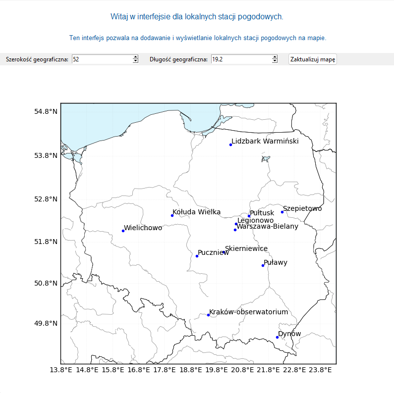
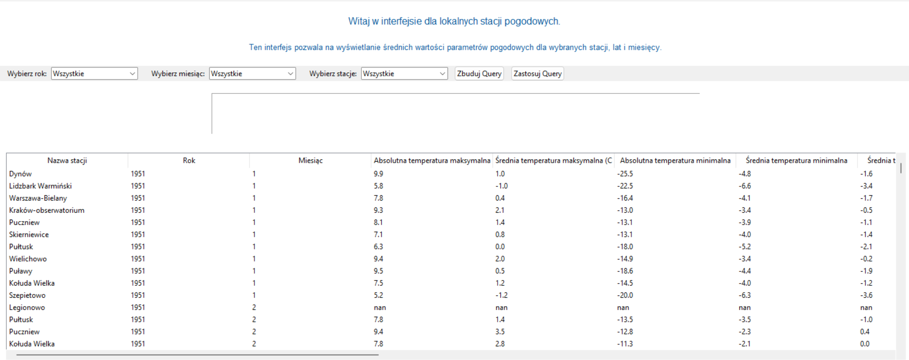

# Interfejs lokalnej stacji pogodowej 

Celem projektu realizowanego w ramach programu Studencki Granty Badawcze UŁ było zastosowanie narzędzi wykrywania anomalii opartych na technikach uczenia maszynowego do danych pogodowych, weryfikacja zasadności takiego podejścia i dostosowanie technik do typu danych. Kalibracja i kontrola parametrów sieci neuronowych użytych w modelu. Wykorzystanie klasycznych metod statystycznych do wykrycia anomalii w zbiorze danych. Walidacja wyników przy użyciu zbiorów testowych. Porównanie podejść statystycznego i opartego na uczeniu maszynowym, ocena tendencji, podobieństw i różnic między nimi. Wykorzystanie sieci typu encoder do etykietowania danych i walidacja wyników. Implementacja każdego z rozwiązań w środowisku Python. Dodatkowo, w ramach badania powstał interfejs użytkownika przeznaczony dla małych i prywatnych stacji pogodowych, który umożliwia samodzielne generowanie mapy stacji pogodowych oraz wyświetlanie statystyk danych pogodowych. Interfejs jest dostępny publicznie w celu popularyzacji zainteresowania klimatem w Polsce. 

## Generator map
Pierwszy interfejs pozwala na generowanie mapy, na której znaduje się lokalna stacja pogodowa użytkownika. 

## Interfejs numeryczny
Drugi interfejs pozwala na wyszukiwanie danych dla poszczególnych miesięcy, lat i stacji klimatycznych. 

